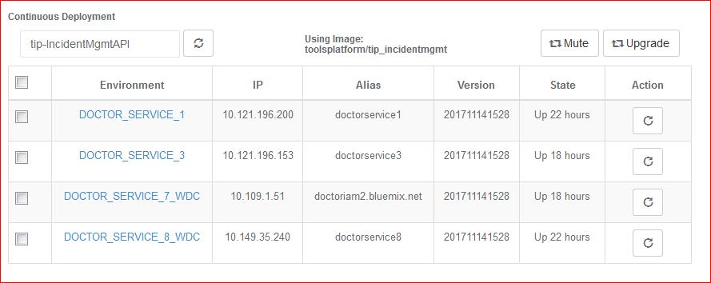
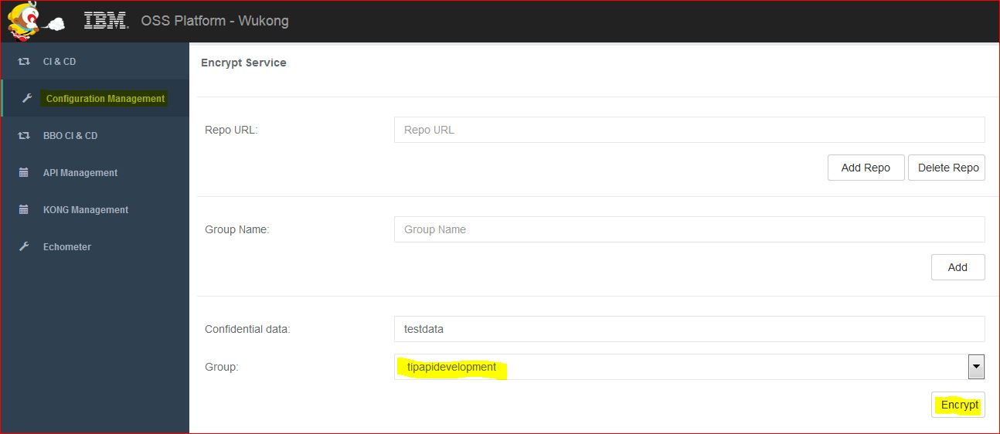

## Overview

Instructions for analyzing and resolving issues related to start / restart of an Incident Management API service in a docker container.

## Possible Root Causes

Failure to start/restart a docker container running an instance of the Incident Management API service can have various root causes.

- Catalog Service not available/reachable - Incident Management API service tries to register with the catalog when started. If registration fails, the Incident Management service will fail to start.

- Catalog Services API returns errors - Incident Management API service tries to register with the catalog when started. It uses APIs to query/update registration status. If APIs return errors, i.e. registration fails, the Incident Management service will fail to start.

- Cipher Service not available/reachable - Incident Management API service depends on Cipher service to get critical credentials at start. If Cipher service is not available/reachable the Incident Management service will fail to start.

- Cipher service is up and running but fails to decrypt credentials. This can be caused by Cipher service functional/authorization issues, by an invalid configuration file, or issues with passing 'group key' needed for decryption to Incident Management instance.

- Newly created docker image has issues - If start fails for a newly created docker image with changes, the docker image/code in it may be the root cause. Check detailed service logs. This needs to be fixed by development.

## Finding Failing Incident Management Instance(s)

First, identify which instance(s) failed to start.

- Go to [{{site.data[site.target].oss-doctor.links.wukong-portal.name}}]({{site.data[site.target].oss-doctor.links.wukong-portal.link}})
- Login, then select CI & CD on the left
- Enter `tip-IncidentMgmtApi` in the entry field under *Continuous Deployment*. This displays environments running Incident Management API instances in production and staging.
- Check the column labelled *State*. The value shows how long a container in the given environment is up and running. Containers with start issues will typically show up time of less than a minute. If a container starts, the value shown will increase. Note that up time shown in the *State* column will not automatically refresh. Click on the refresh button next to thefield where you entered `tip-IncidentMgmtApi`.

  {:width= "700px"}

- Click on the environment link to access the docker host running the container that is currently having issues.

 - Log in to the docker host
 - `sudo docker ps` will list containers running on the docker host
 - Search for the container named *tip-IncidentMgmtApi*
 - Note the value for *CONTAINER ID*
 - Enter the Container ID in the following run statement: `sudo docker exec -it <CONTAINER ID> /bin/bash`
 - *hostname* will display the hostname of the container

Note: 'hostname' is included in log statements available in Kibana in the log field 'hostname'. Filter Logs in Kibana can be used to find a given instance.

Continue with root cause analysis below.

## Catalog Service Not Available or Reachable

To verify catalog service is the root cause, perform the steps outlined below.

#### Check Kibana Log Entries

If the catalog service is not available or reachable you should see the following logs.

```
IncidentMgmtAPI main: ERROR: Failed to register Incident Management API with catalog. Stopping service.
startFromDocker-local.sh: The program returned with exit code 255.
startFromDocker-local.sh: Exiting.
```

If the catalog service is available but its API returns errors (e.g. status 401 - not authorized in example below) you should see the following logs.

```
RegisterAPI: Error: Update Incident Management API failed, id= incidentmgmtap
RegisterApiUpdate: Error: update request failed, status  401
startFromDocker.sh: The program returned with exit code 255.
startFromDocker.sh: Exiting.
```

Note: Only content of log 'msg' field is shown above. Log entries include field 'hostname' which identifies the container which issued the log.

#### Verify API Catalog is up and running

Open a browser and use catalog */healthz* API to check the status. The API returns status 200 if the catalog service is up and running.

[{{site.data[site.target].oss-sosat.links.catalog-service-prod.name}}]({{site.data[site.target].oss-sosat.links.catalog-service-prod.link}})

[{{site.data[site.target].oss-sosat.links.catalog-service-stage.name}}]({{site.data[site.target].oss-sosat.links.catalog-service-stage.link}})

## Actions to resolve issue

- If the catalog service is running, restart the Incident Management API service.
- If Catalog service is down. <mark> [ TODO ] </mark>

## Cipher Service not available/reachable or service returns error

To verify that the Cipher service is the root cause, perform the following steps.

#### Check Kibana log entries

If the Cipher service is not available or reachable you will likely find the following sequence of logs:

```
"GetHostConfiguration: Failed to get config file from Cipher service. Error:  Post https://<cipherserviceip:port>/cloud-oss/cipher/config/retrieve: dial tcp <cipherserviceip:port>: getsockopt: connection timed out"

"IncidentMgmtAPI main: ERROR: failed to process configuration/manifest files. Stopping service."
```

Note: Only content of log 'msg' field is shown above. Log entries include field 'hostname' which identifies the container which issued the log.

#### Verify Cipher service is running

 - Go to [{{site.data[site.target].oss-doctor.links.wukong-portal.name}}]({{site.data[site.target].oss-doctor.links.wukong-portal.link}})
 - Log in and select *Configuration Management* on the left
 - Enter ```tipapidevelopment``` as Group, enter any string into 'Confidential data', then click on Encrypt. A pop-up with the encrypted data will appear. This verifies the Cipher service is running and accessible from the user interface.

   {:width="700px"}


#### Verify Cipher service is reachable from docker host running Incident Management container.

  - Go to [{{site.data[site.target].oss-doctor.links.wukong-portal.name}}]({{site.data[site.target].oss-doctor.links.wukong-portal.link}}) and [identify container(s) with start issues](#finding-failing-incident-management-instances), then click on the respective environment link and log in to the docker host.

    ```
    see if you can ping both (production) Cipher service instances

    ping 10.154.56.42
    ping 10.109.1.21

    at least one instance must be reachable
    ```

    Ensure *\<cipherserviceip:port\>* shown in the Kibana log messages matches one of the IPs above. If there is a mismatch, the root cause might be an incorrect configuration file.

#### Verify the Cipher Service API did not return errors

If the Cipher service is running and accessible there is some chance the API did return errors. Check Kibana for logs indicating Cipher service API errors. Look for the log entries similar to the one shown below.

```
DecryptItem: ERROR: cipher service call failed, reason: ' {{cipher}}c0d5d411508243190_dGlwYXBpZGV2ZWxvcG1lbnQ=_03d3{{secret}} was tampered '"
DecryptHostConfig: ERROR: failed decrypting field= MetricToken , value={{cipher}}c0d5d411508243190_dGlwYXBpZGV2ZWxvcG1lbnQ=_03d3{{secret}} err={{cipher}}c0d5d411508243190_dGlwYXBpZGV2ZWxvcG1lbnQ=_03d3{{secret}} was tampered"
IncidentMgmtAPI main: ERROR: failed to process configuration/manifest files. Stopping service."

or

DecryptItem: ERROR: cipher service call failed, reason: ' please check the group key '
IncidentMgmtAPI main: ERROR: failed to process configuration/manifest files. Stopping service.
```

The above errors need to be fixed by development. They indicate issues with encrypted values in the configuration file or with the group key required for decryption.

#### Check Incident Management API logs

If none of the above steps revealed a potential root cause, or if no relevant logs are available in Kibana, check the detailed logs written at container start for issues.

Please see [TIP Incident Management API How-To: Finding Detailed Service Logs link]({{site.baseurl}}/docs/runbooks/apiplatform/How_To/TIPIncidentManagement_FindingDetailedServiceLogs.html) for instructions.


#### Actions to resolve issue

- If the Cipher service is running, try to restart the Incident Management API service.
- If Cipher service is down <mark> [ TODO ] </mark>
- If Cipher service API returns errors <mark> [ TODO ] </mark>

## Useful links

[TIP Incident Management API How-To: Finding Logs in Kibana]({{site.baseurl}}/docs/runbooks/apiplatform/How_To/TIPIncidentManagement_FindingLogsInKibana.html)

[TIP Incident Management API How-To: Finding Detailed Service Logs link]({{site.baseurl}}/docs/runbooks/apiplatform/How_To/TIPIncidentManagement_FindingDetailedServiceLogs.html)

## Additional Information:
The [SOS Email Dashboard]({{site.data[site.target].oss-sosat.links.new-relic-insight.link}}/accounts/1387904/dashboards/302521) may also be helpful.  
[Mastering Markdown](https://guides.github.com/features/mastering-markdown/)  
[Markdown Table generator](https://www.tablesgenerator.com/markdown_tables)  


## Contacts

**PagerDuty**
* Production [{{site.data[site.target].oss-sosat.links.sosat-critical-alerts.name}}]({{site.data[site.target].oss-sosat.links.sosat-critical-alerts.link}})
* Dev or Test [{{site.data[site.target].oss-sosat.links.sosat-non-critical-alerts.name}}]({{site.data[site.target].oss-sosat.links.sosat-non-critical-alerts.link}})

**Slack**
* [{{site.data[site.target].oss-slack.channels.sosat-monitor-prod.name}}]({{site.data[site.target].oss-slack.channels.sosat-monitor-prod.link}})  

**Runbook Owners**  (try to spread out coverage)  <mark> [ TODO ] </mark>
* owner1@us.ibm.com
* owner2@ie.ibm.com
