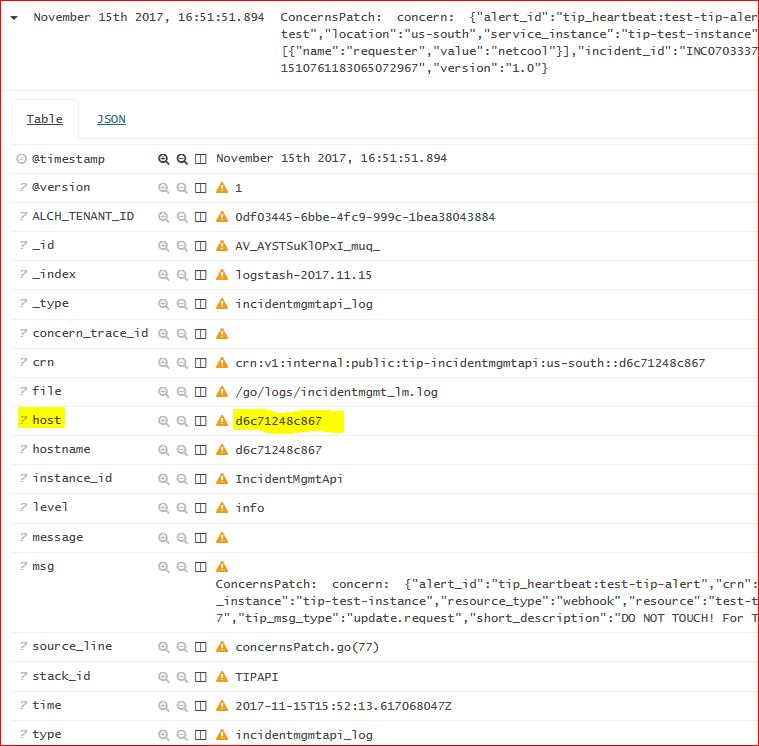

## Overview
Instructions for finding and accessing all available Incident Management API service log files.

## Log files

The Incident Management API service logs are written to multiple logfiles. Log data, level of detail, and format are different.

The following log files exist:

1. **incidentmgmt.log:** Comprehensive, detailed application logs (e.g. data passed over apis, flow of functions).
2. **incidentmgmt_lm.log:** Structured logs (JSON format) sent to Logmet. The file is monitored by *mt-logstash-forward* which forwards log records written to the file to Logmet.
3. **incidentmgmt_console.log:** - Console output which may include information from service start/terminate which cannot be captured elsewhere.

Logfile rotation is enabled for *incidentmgmt.log* and *incidentmgmt_lm.log*.

**Note 1:** Package *mt-logstash-forwarder* needs to be configured in the container. The file does not exist if logging is configured to use Kafka for sending logs to Logmet.

**Note2:**: Logs can be viewed in Kibana4. Please see
[TIP Incident Management API - Finding Logs in Kibana]({{site.baseurl}}/docs/runbooks/apiplatform/How_To/TIPIncidentManagement_FindingLogsInKibana.html).

## Location of log files

Standard location for log files in the container is directory */go/logs*.

Production and staging environment map container */go/logs* directory into the docker host filesystem. This preserves log files at container crash/restart. Logs can be found in docker host under directory  */opt/oss_logs/tip-IncidentMgmtApi*.

```
user@doctoriam2:/opt/oss_logs/tip-IncidentMgmtAPI$ ls -la
total 333792
drwxr-xr-x 2 root root      4096 Nov 14 20:30 .
drwxr-xr-x 3 root root      4096 Oct 24 10:14 ..
-rw-r--r-- 1 root root 104856761 Oct 30 12:02 incidentmgmt-2017-10-30T12-02-08.191.log
-rw-r--r-- 1 root root 104854420 Nov  7 15:52 incidentmgmt-2017-11-07T15-52-48.012.log
-rw-r--r-- 1 root root 104856754 Nov 14 20:30 incidentmgmt-2017-11-14T20-30-52.175.log
-rw-r--r-- 1 root root      1034 Nov 14 19:34 incidentmgmt_console.log
-rw-r--r-- 1 root root  10485480 Nov 10 11:41 incidentmgmt_lm-2017-11-10T11-42-02.223.log
-rw-r--r-- 1 root root   6048992 Nov 15 14:32 incidentmgmt_lm.log
-rw-r--r-- 1 root root  10596749 Nov 15 14:32 incidentmgmt.log
```

If needed, you can access the log file in the container.

```
sudo docker ps   (to get id of container running incidentmgmt api service)
sudo docker exec -it <container id> /bin/bash
cd /go/logs
```

## Accessing log files for a specific instance

You need access to the docker host and a userid on the docker host to access all Incident Management log files.

Every instance of the Incident Management API service has its dedicated set of log files. **You need the container id of the docker container** to access log files for a specific instance of the Incident Management API.

### Getting the Container Id

Incident Management log entries available in Kibana do include the container id of the Incident Management instance which issued the log. Container id is in field *host*.



### Finding the instance for a given Container Id

Go to the [{{site.data[site.target].oss-doctor.links.wukong-portal.name}}]({{site.data[site.target].oss-doctor.links.wukong-portal.link}}) (CI/CD section), and display *tip-IncidentMgmtApi* deployments. You should see something similar to the following:


**Production instances** of the Incident Management API run in the following environments

- DOCTOR_SERVICE_3  
- DOCTOR_SERVICE_7_WDC

To check which containers run in an environment, click on the environment link to access the docker host, log in, and display the running containers:

`sudo docker ps`

This will list the running containers. Look for *tip-IncidentMgmtAPI* and note the *CONTAINER ID*.

Example:
```
CONTAINER ID  IMAGE                                                                      NAMES
d6c71248c867  doctormbus3.bluemix.net:5000/toolsplatform/tip_incidentmgmt:201711141528    tip-IncidentMgmtAPI

```

## Additional Information:
The [SOS Email Dashboard]({{site.data[site.target].oss-sosat.links.new-relic-insight.link}}/accounts/1387904/dashboards/302521) may also be helpful.  
[Mastering Markdown](https://guides.github.com/features/mastering-markdown/)  
[Markdown Table generator](https://www.tablesgenerator.com/markdown_tables)  


## Contacts

**PagerDuty**
* Production [{{site.data[site.target].oss-sosat.links.sosat-critical-alerts.name}}]({{site.data[site.target].oss-sosat.links.sosat-critical-alerts.link}})
* Dev or Test [{{site.data[site.target].oss-sosat.links.sosat-non-critical-alerts.name}}]({{site.data[site.target].oss-sosat.links.sosat-non-critical-alerts.link}})

**Slack**
* [{{site.data[site.target].oss-slack.channels.sosat-monitor-prod.name}}]({{site.data[site.target].oss-slack.channels.sosat-monitor-prod.link}})  

**Runbook Owners**  (try to spread out coverage)
* owner1@us.ibm.com
* owner2@ie.ibm.com
