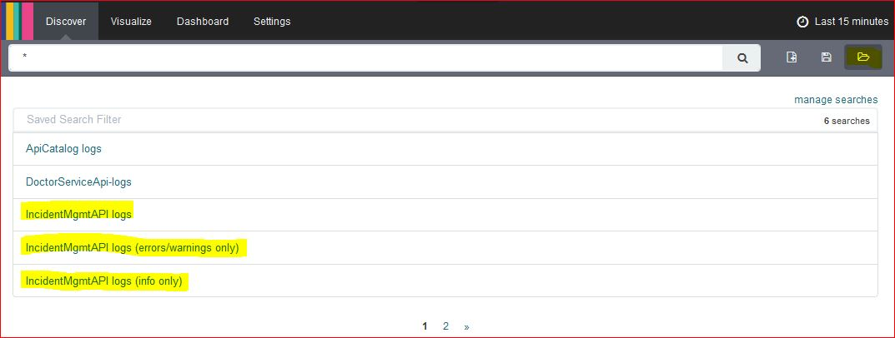
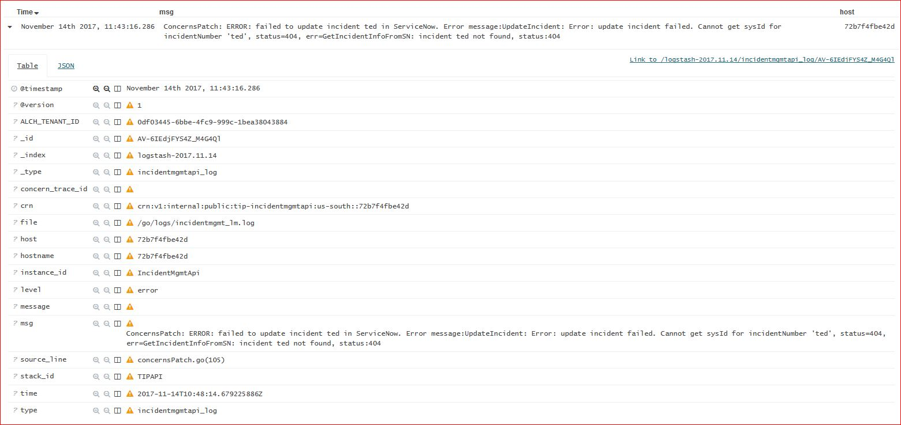

## Overview
Instructions for finding Incident Management API logs in Kibana.

Incident Management API service logs are written to logmet and can be viewed in [Kibana4]({{site.data[site.target].oss-sosat.links.logmet.link}}/app/#/kibana4/discover). Bluemix org is *bluemix.system.log*, space is *ossTools*.

## Predefined Searches

The following predefined searches for the Incident Management API logs exist in Kibana4:

1. [All logs]({{site.data[site.target].oss-sosat.links.logmet.link}}/app/#/kibana4/discover/0df03445-6bbe-4fc9-999c-1bea38043884_IncidentMgmtAPI-logs)

2. [Error and Warning logs]({{site.data[site.target].oss-sosat.links.logmet.link}}/app/#/kibana4/discover/0df03445-6bbe-4fc9-999c-1bea38043884_IncidentMgmtAPI-logs-(errors-slash-warnings-only))

3. [Informational logs]({{site.data[site.target].oss-sosat.links.logmet.link}}/app/#/kibana4/discover/0df03445-6bbe-4fc9-999c-1bea38043884_IncidentMgmtAPI-logs-(info-only))

To view predefined queries in Kibana4, click on the small folder icon  in the top right. A list of existing queries will open.
{:width="700px"}


## Incident Management API Log Fields

Incident Management writes structure logs to Logmet. Every log includes the following service specific fields:

| Fieldname | Description |
|-------|---------    |
| msg   | The actual log message |
| source_line | Source module name and line of the log statement. |
| hostname | Hostname of the docker container running Incident Management API instance which issued the log|
| time  | Time when log entry was created in the service. This might be different from the value of @timestamp shown in Kibana. |
| level | Log level. Possible values are: info, warn, error. |
| instance_id | Value is 'IncidentMgmtApi'. |
| crn | CRN of Incident Management API service instance that sent the log |
| concern_trace_id | Value of trace_id field provided in concern.extras. Set in selected logs only. |
{: style="margin:0 0"}

\\
The above fields are useful for creating specific queries or finding logs written by the Incident Management API service.

Here is a sample log entry:
{:width="700px"}

## Creating Your Own Search

Fields described in the previous section are useful to create special purpose searches if needed. Here are some examples:

The following search term will return all the Incident Management API logs:

```
instance_id:IncidentMgmtApi
```
The following search term will return all the Incident Management API logs for a specific instance:

```
instance_id:IncidentMgmtApi AND hostname:7fd8dba93ca1
```

The following search term will return an error and warning in the Incident Management API logs:

```
instance_id:IncidentMgmtApi AND (level:warn OR level:error)  
```

## Additional Information:
The [SOS Email Dashboard]({{site.data[site.target].oss-sosat.links.new-relic-insight.link}}/accounts/1387904/dashboards/302521) may also be helpful.  
[Mastering Markdown](https://guides.github.com/features/mastering-markdown/)  
[Markdown Table generator](https://www.tablesgenerator.com/markdown_tables)  


## Contacts

**PagerDuty**
* Production [{{site.data[site.target].oss-sosat.links.sosat-critical-alerts.name}}]({{site.data[site.target].oss-sosat.links.sosat-critical-alerts.link}})
* Dev or Test [{{site.data[site.target].oss-sosat.links.sosat-non-critical-alerts.name}}]({{site.data[site.target].oss-sosat.links.sosat-non-critical-alerts.link}})

**Slack**
* [{{site.data[site.target].oss-slack.channels.sosat-monitor-prod.name}}]({{site.data[site.target].oss-slack.channels.sosat-monitor-prod.link}})  

**Runbook Owners**  (try to spread out coverage)
* owner1@us.ibm.com
* owner2@ie.ibm.com
